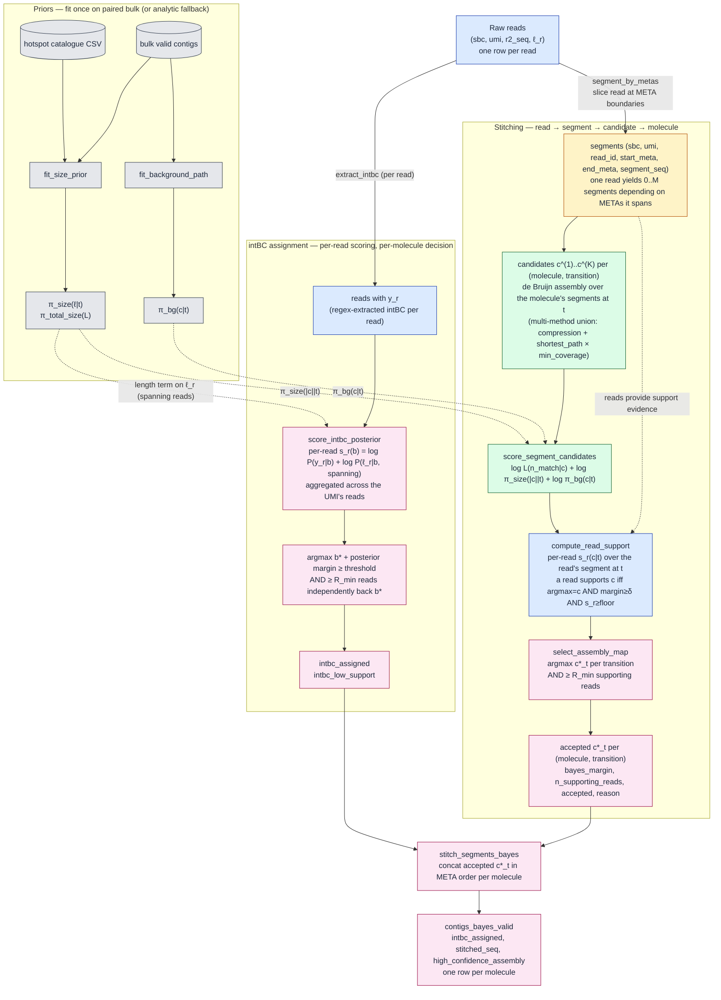

# Bayesian Assembly Model for PEtracer Molecules

**Status**: Design, not yet implemented (Apr 2026)

## Context

The segmentation-based assembly in `ogtk.ltr.fracture.pipeline` has three coupled failure modes, catastrophic in low-quality (pooled single-cell) libraries and visible as near-empty output after `min_molecule_len` filtering:

1. **intBC-UMI assignment is unreliable.** The intBC locus sits at the opposite end of the cassette from the UMI. `assign_umi_intbc` (`ogtk/ltr/fracture/pipeline/api_ext.py:549-637`) picks the per-UMI dominant intBC by raw read count. In contaminated libraries the most frequent intBC comes from short PCR chimeras, not from the true molecule.
2. **Stitching is implicitly greedy.** Per-transition consensus is whatever the de Bruijn graph converges on, and the downstream heterogeneity filter in `generate_segmentation_report` (`segmentation.py:468-495`) keeps transitions with `freq ≥ 0.20 × dominant`. In libraries where short PCR artefacts dominate a transition, the wrong consensus wins.
3. **Cascade.** Wrong intBC locks the wrong reads into a molecule → wrong transition matrix → truncated stitched contigs → `min_molecule_len` filter drops almost everything.

The empirical picture of the PCR bias driving these failures is documented in `docs/pcr_bias_analysis_plan.md` (bimodal read-length distribution, p50=446bp against a ~1kb cassette, ambient-DNA enrichment at ~38% deletion fraction in scc_6_6 vs ~2% in bulk). The chimera generation mechanism is sketched in `docs/pcr_chimera_mechanism.svg`.

This plan formalises a posterior-probability model that replaces the count-vote intBC assignment and the greedy stitching with a unified Bayesian decoder. The model:

- scores intBC candidates per UMI under a length-aware likelihood;
- scores per-transition consensus candidates under a size prior and a population-level background-path prior;
- uses priors fit from a paired bulk library when available, falling back to an analytic cassette-theoretical prior;
- resolves the short-PCR vs real-short-deletion tension via a curated **known-hotspot catalogue** per cassette type plus the background-path prior;
- accepts a candidate only when **≥ `R_min` reads independently support it with a high per-read score** (selection gate).

The model ships as a single combined release covering intBC and stitching together — the failure cascade means fixing only one stage is not verifiably useful.

## Mathematical formulation

Notation.

- Molecule: `g = (sbc, umi)` for bulk / SM, `g = (cbc, umi)` for SC.
- Reads for the molecule: `R_g`.
- Transition path for the declared cassette: `T = (t_1, ..., t_M)`, derived from `CASSETTE_CONFIGS` (e.g. 5mer = 4 METAs, 10mer = 9 METAs). Each `t_i = (start_meta_i, end_meta_i)`.
- Candidate consensus set at transition `t` for molecule `g`: `C_{g,t} = {c^{(1)}, ..., c^{(K)}}`.
- Assembly: `A_g = (c_{g,t_1}, ..., c_{g,t_M})`.

### Per-segment posterior

```
P(c | R_g, t) ∝ L(R_g, t | c) · π_size(|c| | t) · π_bg(c | t)
```

- **Likelihood** `L`: Bernoulli noise model over matching reads with noise floor ε ≈ 0.02.
  `log L = n_match(c) · log(1-ε) + (n_obs - n_match(c)) · log(ε)`, where `n_match(c)` counts reads whose segment at `t` is within edit-distance ≤ 2 of `c`.
- **Size prior** `π_size(ℓ | t)`: 2-component mixture — expected-length mode plus deletion-hotspot mode(s) seeded from a curated catalogue.
- **Background-path prior** `π_bg(c | t)`: categorical empirical-Bayes prior over consensuses observed across the population at `t`, with Laplace smoothing.

### Whole-molecule posterior

Per-transition terms are conditionally independent given the META anchors (neighbouring segments share anchors), so:

```
P(A_g | R_g) ∝ π_total_size(Σ |c_t| | cassette_type) · Π_t [ L · π_size · π_bg ]
```

Decoding decomposes into per-transition argmax plus a global length rescoring step on the stitched molecule. No MCMC or full EM over molecules is required.

### intBC–UMI posterior

```
P(b | R_g) ∝ π_intbc(b) · Π_r [ P(y_r | b) · P(ℓ_r | b, spanning) ]
```

- `y_r`: per-read extracted intBC (null if the read does not span the intBC locus).
- `P(y_r | b) = (1-q) · 1[y_r = b] + q · uniform` when the read spans; null extractions contribute the spanning complement.
- `P(ℓ_r | b, spanning)`: per-read length prior conditional on the intBC being real. Real intBC reads span intBC to UMI; their length distribution matches full-cassette `π_size`. A short chimera implies an abnormally short molecule under any `b` that requires spanning — this term is what kills the chimera vote.
- `π_intbc(b)`: light empirical prior on intBC marginal abundance; mainly for singleton regularisation.

Decision for intBC: `b* = argmax_b P(b | R_g)`. `intbc_valid` iff both (i) the log-posterior margin over the runner-up exceeds `bayes_decision_threshold` (default 2.0) AND (ii) the multi-read support gate (below) passes.

## Implementation and data flow

Four data levels run through the pipeline. Keeping them straight is essential because the model operates differently at each level.

- **Read** — one raw sequencing read. Identified by `(sbc, umi, read_id)`. Carries `r2_seq` and length `ℓ_r`. The intBC extraction `y_r` is read-level.
- **Segment** — a slice of a read between two META boundaries. Identified by `(sbc, umi, read_id, start_meta, end_meta)`. **A single read produces 0 to M segments** depending on how many META boundaries it spans. A short read covering only META01 → META04 yields segments at transitions (01,02), (02,03), (03,04) and nothing at later transitions. Carries `segment_seq` and `ℓ_{r,t}`.
- **Candidate consensus** — a proposed assembled sequence for transition `t` of molecule `g`. Produced by de Bruijn assembly over the molecule's segments at `t`. Identified by `(sbc, umi, start_meta, end_meta, candidate_id)`.
- **Molecule** — `(sbc, umi)` for bulk/SM, `(cbc, umi)` for SC. The unit the final stitched contig is emitted for.

**Where reads vs segments appear**:

- intBC scoring operates on **reads**. Each read has at most one intBC extraction; the posterior over `b` aggregates per-read scores across the UMI's reads.
- Segmentation turns **reads into segments**.
- Per-transition candidate generation and candidate scoring operate on **segments** (and on the candidates derived from them).
- The support gate re-indexes segments back to their reads: "read `r` supports candidate `c` at transition `t`" iff `r` **has a segment at `t`** and that segment scores c as its top choice. A read that never covers `t` contributes nothing to `t` — it is absent from the count, not a negative vote.
- Stitching is **molecule**-level.



Key callouts on the diagram:

- The **intBC path** (upper subgraph) stays at read level right up to the final vote; the size prior contributes to the per-read term `P(ℓ_r | b, spanning)`. The background-path prior does **not** enter intBC scoring — it only matters once we have a concrete candidate sequence to compare against the population.
- The **stitching path** (lower subgraph) fans out from reads to segments to candidates, scores each candidate with both priors and the match-likelihood, then contracts again through the support gate to per-transition acceptances and finally a per-molecule stitched contig.
- The **support gate** (`compute_read_support` + the `≥ R_min` check inside `select_assembly_map`) is the single place where reads re-enter the stitching path after segmentation. This is what enforces the "≥ 2 reads independently back the same high-scoring consensus" rule.
- A read that did not span transition `t` simply does not appear in any of `t`'s candidate scorings. It is never scored as "against" any candidate at `t`; it is absent.

## Priors

### Size prior

`fit_size_prior(bulk_contigs, metas, hotspot_catalogue, mode) -> SizePrior`

Modes:

- **`empirical`** (preferred when paired bulk is available): KDE per transition over observed segment lengths in bulk contigs, restricted to the **clean subpopulation** (`_is_valid_assembly=True` at every transition; `_n_segments == len(T)`). Restriction is required to avoid truncation-dominated fits.
- **`analytic`** (fallback when bulk is absent): per-transition Gaussian `N(μ_t, (0.05 · μ_t)²)`, with `μ_t` derived from CASSETTE_CONFIGS (META_LEN + expected target-span + flanks) for the declared cassette_type.

Short-mode components are injected per transition from the `hotspot_catalogue`. Mixture weights come from catalogue-declared frequencies; when a frequency is absent, default to `0.1` per hotspot. A global `π_total_size(L)` is also fit over full-length stitched bulk contigs.

### Background-path prior

`fit_background_path(bulk_assembled, metas, iterations=1) -> BackgroundPathPrior`

Procedure:

1. Restrict to the clean subpopulation (same definition as above). This is the most important mitigation against the PCR-chimera feedback loop — without it, short artefacts dominate the population and would be reinforced by the prior.
2. Cluster near-identical consensuses per transition (edit-distance ≤ 2).
3. Smooth with Laplace: `π_bg(c | t) = (f(c | t) + α) / (1 + K · α)`, `α = 1e-3`, `K =` number of clusters at `t`.
4. Clip to `[1e-4, 0.95]` — no candidate is absolutely ruled in or out by population frequency alone.
5. Optional EM-lite refit (default off; gated by `bayes_em_iterations > 1`) after a first scoring pass, using only posterior-high molecules.

### Hotspot catalogue

New file `configs/bayes_hotspots/<cassette_type>.csv` (one file per cassette type):

```
cassette_type,transition_start,transition_end,deletion_bp,frequency
5mer,META04,META05,581,0.35
5mer,META02,META03,765,0.30
```

Transitions use the same META names as `CASSETTE_CONFIGS` in `cassiopeia_petracer.py`. The 5mer catalogue is seeded from the dominant breakpoints documented in `docs/pcr_bias_analysis_plan.md:89-100`. 10mer and 20mer catalogues are additive — empty until real data calls for entries.

## Selection (multi-read support gate)

A candidate is accepted only when **at least `R_min` distinct reads independently score it as their top choice with a high confidence margin**. This turns the per-candidate posterior into an acceptance decision and prevents singletons from passing on priors alone.

**Per-read log-score** at transition `t` from read `r`:

```
s_r(c | t) = log P(segment_{r,t} | c)    # Bernoulli match/mismatch, edit-distance ≤ 2
           + log π_size(ℓ_{r,t} | t)     # length term, only when the read covers enough of t (≥80%)
```

**A read supports `c` at `t`** iff all three hold:

1. `argmax_{c' ∈ C_{g,t}} s_r(c') = c`  (c is the read's own top choice).
2. `s_r(c) - max_{c' ≠ c} s_r(c') ≥ δ_read`  (per-read margin, default `bayes_read_margin = 1.0` log-units).
3. `s_r(c) ≥ s_floor`  (absolute floor; rules out reads that score poorly for every candidate — likely chimeras).

**Per-transition acceptance**: `c*_t` is accepted iff `#{r : r supports c*_t} ≥ bayes_min_read_support` (default 2). Otherwise emitted with `accepted=False` and `reason='insufficient_support'`.

**Per-molecule acceptance** (`high_confidence_assembly=True`): every transition along the cassette path has an accepted candidate. Missing / low-support transitions degrade the molecule to `high_confidence_assembly=False` without discarding it — downstream analyses choose whether to filter on the flag.

**intBC analogue**: for each read `r` with a non-null extraction `y_r`, compute `s_r(b) = log P(y_r | b) + log π_size(ℓ_r | b, spanning)` for every candidate `b` in the UMI. Read `r` supports `b` iff `argmax_b s_r(b) = b` and the per-read margin exceeds `δ_read`. Accept `b*` iff (i) `#{r : r supports b*} ≥ bayes_min_read_support` AND (ii) the molecule-level posterior log-margin exceeds `bayes_decision_threshold`. Otherwise `intbc_assigned = null` and the molecule is flagged `intbc_low_support`.

**Design rationale**:

- "More than one read" → hard threshold on supporting-read count.
- "With the same high score" → each supporting read must individually rank `c*` first AND exceed the absolute floor, preventing a "lesser of evils" outcome where all reads score the candidate badly but `c*` happens to be the least bad.
- Selection is separated from acceptance: the posterior chooses `c*`, the support gate decides whether to **commit** to it.

**Low-coverage edge case**: scc_6_6 has median reads/UMI = 1 (`pcr_bias_analysis_plan.md:27`). A strict `R_min = 2` will mark roughly half of UMIs as low-support — the correct outcome (we genuinely lack evidence). `bayes_min_read_support = 1` is allowed for permissive runs, but molecules relying on it are flagged `singleton_supported = True` so downstream tools can discriminate.

## Emitted columns

### Per-transition

| Column | Type | Meaning |
|---|---|---|
| `bayes_candidate_posterior` | f64 | log-posterior of the winning candidate |
| `bayes_margin` | f64 | log-posterior gap over the second-best candidate |
| `bayes_n_supporting_reads` | i64 | count of reads passing the support rule |
| `accepted` | bool | result of the support gate |
| `reason` | str | failure reason when `accepted=False` (`insufficient_support`, `margin_below_threshold`, `no_candidates`) |

### Per-molecule

| Column | Type | Meaning |
|---|---|---|
| `high_confidence_assembly` | bool | every transition accepted |
| `n_accepted_transitions` | i64 | number of accepted transitions |
| `singleton_supported` | bool | true if any accepted transition has `bayes_n_supporting_reads == 1` (relevant only when `R_min = 1`) |
| `assembly_suspect` | bool | stitched length falls below the 1% quantile of `π_total_size` and no deletion mode activates |

### intBC

| Column | Type | Meaning |
|---|---|---|
| `intbc_assigned` | str (nullable) | assigned intBC; null when the dual gate fails |
| `intbc_posterior` | f64 | molecule-level log-posterior of `b*` |
| `intbc_log_margin` | f64 | log-posterior gap vs runner-up |
| `intbc_n_supporting_reads` | i64 | supporting-read count |
| `intbc_low_support` | bool | flag when the support gate is the reason for rejection |
| `intbc_valid_read` | bool | kept for compatibility with the legacy column; now computed from the Bayes assignment |

## Integration

### Files to modify

- `ogtk/ltr/fracture/pipeline/api_ext.py`
  - In `assign_umi_intbc` (lines 549-637): branch on `bayes_config`. When provided, call into `bayes.score_intbc_posterior`; else keep the legacy count-vote path.
  - In `assemble_segmented` (starts line 1276): when `bayes_config` is present, collect top-K candidates per transition (near lines 1393, 1416), score them via `bayes.score_segment_candidates`, and feed the accepted consensuses to the stitch step.
- `ogtk/ltr/fracture/pipeline/segmentation.py`
  - Add `stitch_segments_bayes()` that accepts the scored-candidates table.
  - Extend `generate_segmentation_report` (line 364) to export the population transition consensus table used by `fit_background_path`.
- `ogtk/ltr/fracture/pipeline/core.py`
  - At preprocess (line 753): pass `bayes_config` into `assign_umi_intbc` when enabled.
  - At fracture (line 833): before the assembly call, run the prior-fit sub-step (load bulk artefacts if `bayes_prior_source` points there, else fit analytic).
- `ogtk/ltr/fracture/pipeline/types.py` (FractureXp): add the new fields listed in **Configuration** below.
- `ogtk/ltr/fracture/extensions/cassiopeia_petracer.py`: `min_molecule_len` (line 1140) stays as a hard cutoff under the default behaviour. A posterior-length filter is deferred to v2.

### New modules and files

- `ogtk/ltr/fracture/pipeline/bayes.py` — all new math:
  - `fit_size_prior(bulk_contigs_ldf, metas, hotspot_catalogue_df, mode) -> SizePrior`
  - `fit_background_path(bulk_assembled_ldf, metas, iterations=1) -> BackgroundPathPrior`
  - `score_intbc_posterior(reads_ldf, size_prior, intbc_prior, int_anchor1, int_anchor2, group_cols, decision_threshold, min_read_support, read_margin, read_score_floor) -> LazyFrame`
  - `generate_segment_candidates(segments_ldf, k_values=[15], coverage_values=[20, 10], methods=['compression','shortest_path']) -> LazyFrame` — Python-only top-K via method-union (no rogtk changes in v1)
  - `score_segment_candidates(candidates_ldf, size_prior, bg_prior, metas) -> LazyFrame`
  - `compute_read_support(segments_ldf, scored_candidates, read_margin, read_score_floor) -> LazyFrame`
  - `select_assembly_map(scored_candidates, read_support, total_size_prior, min_read_support) -> LazyFrame`
- `ogtk/ltr/fracture/pipeline/bayes_priors.py` — serialisation to parquet at `{sample_wd}/bayes_priors/{size,bg_path,intbc}.parquet`, so SC runs can load a paired-bulk prior.
- `configs/bayes_hotspots/{5mer,10mer,20mer}.csv` — known-hotspot catalogues; 5mer seeded from `docs/pcr_bias_analysis_plan.md:89-100`.

### Output files

The Bayesian path writes to separate output files to preserve backwards compatibility:

- `{sample_wd}/contigs_bayes_valid.arrow` (or `.parquet`), analogous to `contigs_segmented_valid.arrow`.
- `{sample_wd}/bayes_priors/` contains the fit prior artefacts.

Existing `contigs_segmented_*` paths are not touched. Tree-building reads whichever contig path the user points it at.

## Configuration

New fields on `FractureXp`:

| Field | Default | Description |
|---|---|---|
| `bayesian_assembly` | `False` | Master switch. When true, the Bayes path runs in preprocess and fracture. |
| `bayes_prior_source` | `'auto'` | `'bulk_parquet'` / `'analytic'` / `'auto'` (use bulk if path exists, else analytic with a warning). |
| `bayes_prior_path` | `None` | Path to a `bayes_priors/` directory from a paired bulk run. |
| `bayes_hotspot_catalogue` | `None` | CSV under `configs/bayes_hotspots/`. |
| `bayes_cassette_type` | `None` | `'5mer'`, `'10mer'`, `'20mer'` — used by the analytic prior. |
| `bayes_topk` | `5` | Candidate count per transition. |
| `bayes_decision_threshold` | `2.0` | Log-posterior margin required for intBC acceptance. |
| `bayes_em_iterations` | `1` | Background-prior refit iterations. |
| `bayes_min_read_support` | `2` | `R_min` for the selection gate. |
| `bayes_read_margin` | `1.0` | Per-read log margin a supporting read must exceed. |
| `bayes_read_score_floor` | `-5.0` | Absolute per-read score floor; reads below this abstain. |

### Example YAML

```yaml
# Single-cell run using bulk priors from the paired library
bayesian_assembly: true
bayes_prior_source: bulk_parquet
bayes_prior_path: /archive/users/pedro/ny/4T1_11/bayes_priors/
bayes_hotspot_catalogue: configs/bayes_hotspots/5mer.csv
bayes_cassette_type: 5mer
bayes_topk: 5
bayes_decision_threshold: 2.0
bayes_em_iterations: 1
bayes_min_read_support: 2
bayes_read_margin: 1.0
bayes_read_score_floor: -5.0
```

## Usage

### Fit priors on a bulk library

```bash
python -m ogtk.ltr.fracture.pipeline.bayes_priors fit \
  --contigs /archive/users/pedro/ny/4T1_11/contigs_segmented_valid.arrow \
  --metas configs/petracer_5mer_metas.csv \
  --hotspots configs/bayes_hotspots/5mer.csv \
  --cassette-type 5mer \
  --out /archive/users/pedro/ny/4T1_11/bayes_priors/
```

### Run fracture with Bayes assembly on a paired SC library

```bash
python -m ogtk.ltr.fracture.pipeline.core run --config configs/scc_6_6_bayes.yaml
```

### Bulk-only (no paired-bulk prior, falls back to analytic)

```yaml
bayesian_assembly: true
bayes_prior_source: analytic
bayes_cassette_type: 5mer
bayes_hotspot_catalogue: configs/bayes_hotspots/5mer.csv
bayes_min_read_support: 2
```

## Phased delivery

- **P0 — Priors and hotspot catalogue.** Implement `fit_size_prior`, `fit_background_path`, `bayes_priors.py`. Seed `configs/bayes_hotspots/5mer.csv`. Validate on 4T1_11 bulk contigs; confirm peaks at expected transition lengths and short-mode weights near catalogue frequencies.
- **P1 — intBC scorer.** Implement `score_intbc_posterior`. Wire into `assign_umi_intbc` under the Bayes branch. Unit tests on a synthetic fixture with known chimera patterns. A/B runs on scc_6_6 (contaminated SC) vs F7_1_FACS (clean SM).
- **P2 — Candidate generation and per-segment scorer.** Implement `generate_segment_candidates` and `score_segment_candidates`. Regression sanity: posterior argmax must equal today's greedy result on the clean subpopulation when priors are flat.
- **P3 — Joint decoding, Bayes stitch, and support gate.** Implement `compute_read_support`, `select_assembly_map`, `stitch_segments_bayes`. Wire end-to-end in `assemble_segmented`. Run scc_6_6 vs F7_1_FACS. Produce the `bayes_min_read_support ∈ {1, 2, 3}` trade-off curve and pick the shipping default on real data.
- **P4 — SC paired-bulk integration.** SC mode loads bulk artefacts via `bayes_prior_path`. Validate scc_6_6 (SC) against 4T1_11-fit priors. Confirm SC intBC assignments agree with bulk consensus.
- **P5 — Docs and back-link.** Cross-reference from `docs/pcr_bias_analysis_plan.md` Recommendations.

**Not in v1** (deferred): EM iteration past 1 pass, posterior-length filter replacing `min_molecule_len`, native top-K paths in rogtk, transition-adjacency prior.

## Verification

**Simulated data**. A small fixture generates reads from a known cassette + intBC map with tunable PCR-chimera fraction (length distribution skewed to match observed p50=446bp). Targets:
- `score_intbc_posterior` recovers ground-truth intBC in ≥ 95% of molecules at 50% chimera fraction, vs count-vote failing around 60% under the same stress.
- Per-transition posterior selects the true consensus in ≥ 98% of molecules with ≥ 2 full-length supporting reads.

**Real data cross-library check**. Using the intBC matrix at `pcr_bias_analysis_plan.md:104-109`: pick an intBC present in both 4T1_11 (bulk) and scc_6_6 (SC). Bayesian SC assignment of scc_6_6 molecules to that intBC should agree with the bulk consensus.

**End-to-end metrics** (reported before/after per sample):

- Fraction of molecules with full-length valid assembly.
- Median and 90th percentile stitched length.
- Per-UMI intBC entropy (expect to drop).
- Distinct consensuses per transition after scoring (expect consolidation).
- Multi-read support uptake: fraction of molecules with `high_confidence_assembly=True`; distribution of `bayes_n_supporting_reads`; molecules lost to `insufficient_support`; trade-off curve over `bayes_min_read_support ∈ {1, 2, 3}`.
- intBC low-support rate: fraction of UMIs where `intbc_low_support=True`.
- Downstream: cells surviving `min_umis_per_cell=4` in `cassiopeia_petracer.collapse_umis_to_cells` on scc_6_6 (currently near zero after length filtering; target: non-trivial recovery).

## Open questions

- Mixture-weight schema when catalogue frequencies are unknown. Default `0.1` seed may need per-cassette tuning.
- Whether `π_total_size` rescoring should veto assemblies or only flag them. Plan uses flag-only (`assembly_suspect=True`); revisit after P3 metrics.
- Per-transition vs global `bayes_topk`.
- Final default for `bayes_min_read_support`. `2` enforces the user's rule, but libraries with median reads/UMI = 1 lose many molecules. The P3 trade-off curve decides whether the shipping default is `1` (permissive, with `singleton_supported` flag) or `2` (strict).
- Inclusion of `log π_size(ℓ_{r,t} | t)` in the per-read score for reads that partially cover a transition. Plan gates on ≥80% coverage; verify on bulk.

## Related documents

- `docs/pcr_bias_analysis_plan.md` — empirical findings on PCR bias, ambient DNA contamination, and the chimera/deletion patterns the model is calibrated against.
- `docs/pcr_chimera_mechanism.svg` — chimera-generation mechanism sketch.
- `docs/tree_building_plan.md` — downstream consumer of the contig output.
- `docs/smolscells_extension_plan.md` — LineageForest aggregation, one step further downstream.
